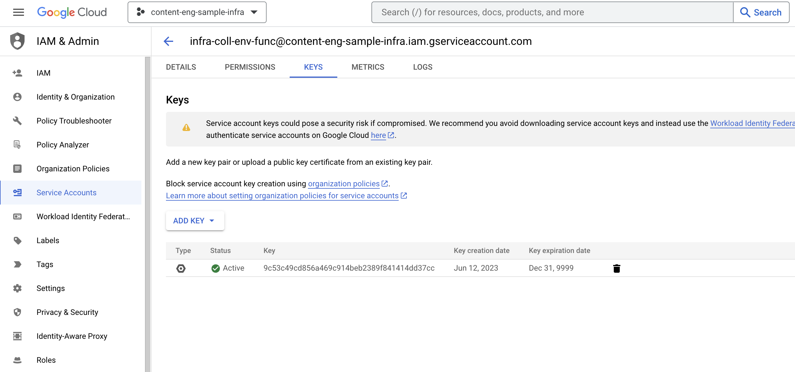

# POC Project
content-eng-sample-infra
# How to configure
Need json key for service account



## Run local
Assumes that you have key for service account

Asset Export
```
python3 -c 'from main import sample_export_assets; sample_export_assets()'
```

TO_DO - Process export from buckets

Create Feed
```
python3 -c 'from main import sample_create_feed; sample_create_feed()'
```

Parsing of the Bucket
```
python3 -c 'from main import list_blobs; list_blobs()'
```

## Links we need

[asset_service](https://cloud.google.com/python/docs/reference/cloudasset/latest/google.cloud.asset_v1.services.asset_service)

[export_assets](https://cloud.google.com/python/docs/reference/cloudasset/latest/google.cloud.asset_v1.services.asset_service.AssetServiceClient#google_cloud_asset_v1_services_asset_service_AssetServiceClient_export_assets)

[create_feed](https://cloud.google.com/python/docs/reference/cloudasset/latest/google.cloud.asset_v1.services.asset_service.AssetServiceClient#google_cloud_asset_v1_services_asset_service_AssetServiceClient_create_feed)

[supported-asset-types](https://cloud.google.com/asset-inventory/docs/supported-asset-types)


[ContentType](https://cloud.google.com/python/docs/reference/cloudasset/latest/google.cloud.asset_v1.types.ContentType)

Very interested in the relationship type

[storage trigger](https://cloud.google.com/functions/docs/calling/storage)