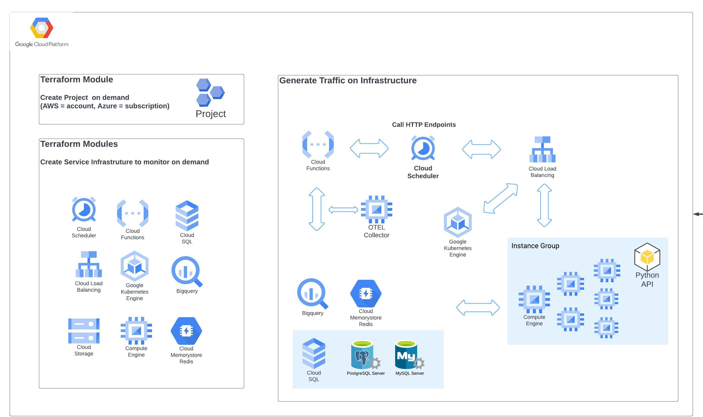

# What is this
Contents of this folder have the terraform and other code needed to deploy sample infrastructure for all of the services in GCP.




# How to deploy sample infrastructure

!!!The Terraform code in sample_infrastructure assumes you have a GCP Project set up with proper permissions!!!
See "Sample project creation terraform" below for example

KNOWN ISSUE - If you get the error "Error: Provider produced inconsistent final plan" referencing cloud scheduler change the local variable string in main.tf
```
hack = "${module.function_bigquery.bucket_object.md5hash}=1234"
```
main.tf file in this directory contains all the modules contained and will deploy all infrastructure contained. 

It is designed to be read from top to bottom and you can comment out everything and deploy modules one at a time working from top to bottom.

Modules and their dependencies should be self-explanatory.

If you comment out modules in main.tf look at corresponding values in output.tf.

The collection folder contains terraform to deploy collection resources to GCP using either the local path or remote registry.


# Deploying sock-shop on GKE instance
The current code is here - https://github.com/observeinc/content-eng-sock-shop-temp/tree/main/sockshop

Sock-shop deployment with OTEL instrumentation is under development and will change but there should be a link to deployable versions here

# Sample project creation terraform
```
locals {
  services_to_enable = [
    "artifactregistry.googleapis.com",
    "bigquery.googleapis.com",
    "bigquerydatatransfer.googleapis.com",
    "cloudapis.googleapis.com",
    "cloudasset.googleapis.com",
    "cloudbuild.googleapis.com",
    "clouddebugger.googleapis.com",
    "cloudfunctions.googleapis.com",
    "cloudresourcemanager.googleapis.com",
    "cloudscheduler.googleapis.com",
    "cloudtrace.googleapis.com",
    "compute.googleapis.com",
    "container.googleapis.com",
    "containerregistry.googleapis.com",
    "iam.googleapis.com",
    "logging.googleapis.com",
    "monitoring.googleapis.com",
    "pubsub.googleapis.com",
    "run.googleapis.com",
    "servicemanagement.googleapis.com",
    "serviceusage.googleapis.com",
    "storage.googleapis.com",
    "redis.googleapis.com"
  ]
}

resource "google_project" "project" {
  name       = var.project_name
  project_id = var.project_id
  # omit folder id if not using
  folder_id     = var.folder_id

  billing_account = var.billing_account
}


resource "google_project_service" "project" {
  for_each = { for value in local.services_to_enable : value => value }
  project  = var.project_id
  service  = each.value

  timeouts {
    create = "30m"
    update = "40m"
  }

  disable_dependent_services = true
}

resource "google_project_iam_binding" "project" {
  project = google_project.project.project_id
  role    = "roles/owner"

  members = setunion([
    ], var.project_owner
  )
}

variable "project_name" {
  type = string
}

variable "project_id" {
  type = string
  description = "GCP project to deploy to"
}

variable "org_id" {
  type = string
}

variable "folder_id" {
  type = string
}

variable "billing_account" {
  type = string
}

variable "project_owner" {
  default = []
}

output "project" {
  value = google_project.project
}

output "project_id" {
  value = var.project_id
}

```

